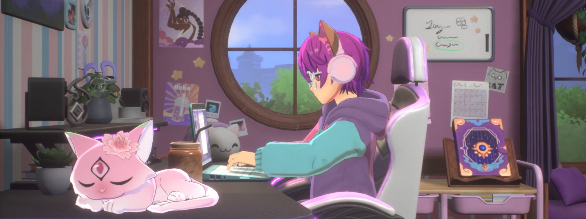

- 👋 Hi, I’m @scatyf3
- 🎓 BSCS@BNU, Research Intern@SIT, incoming MSCE@NYU
- 👀 My research interests are in LLM/MLSYS/HPC
- 🌈 Friendly to the underrepresent group

<!DOCTYPE html>
<html lang="en">
<head>
    <meta charset="UTF-8">
    <meta name="viewport" content="width=device-width, initial-scale=1.0">
    <title>Opportunities</title>
    
</head>
<body>
    
 I am looking for internship opportunities in summer 2026 and PhD positions in fall 2027.

</body>
</html>

## Tool stack
- coding tools: 

- learning/writing/communication tools: 

- mindset: [Articles that shaped me](https://www.notion.so/6379b986d4964818b078b0328b41f73b?v=19fc0e6483ec4fada09d6c68f7b20732), with a special recommendation to read CS101 and 科研入门(Introduction to Research).

## Contact 

<!--TOBE Polish 我期待与不同背景的人交流，尤其包括给志同道合的后辈提供建议，特别是在这些主题：神经多样性支持，如何找Research/SDE实习，北美研究生申请，介绍有帮助的cs活动-->
- 📧 scatyf3@gmail.com
- 💬 discord: scat_114 | wechat: scat114

## Misc
- 🤓Hobbies
  - 📕 History and Social Science
  - 🎮 Gaming: FPS/Rhythm/Card/Indies...
  - ⛰ Outdoor Activities: Hiking/Trail running
- ❤Friend Link：[WendyL42](https://github.com/Wendyl42)
